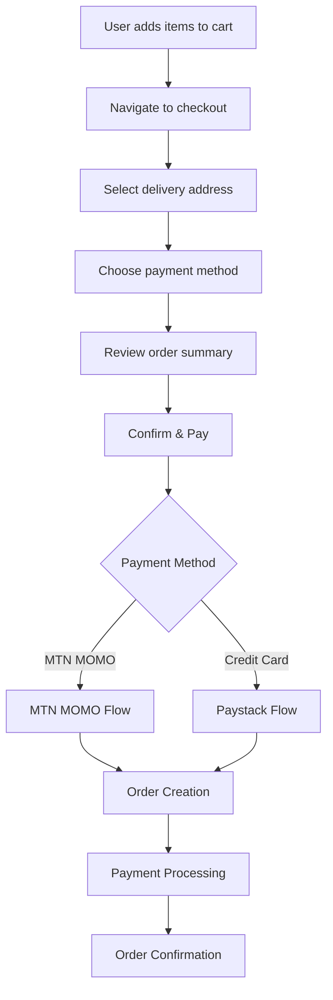
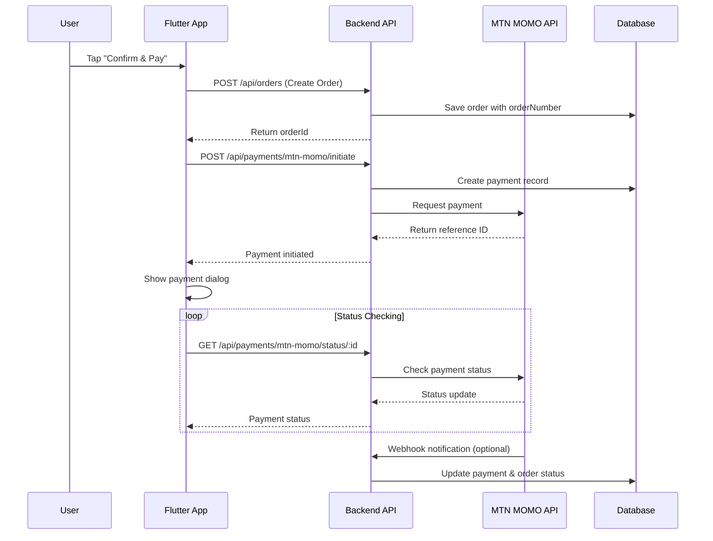

# GrabGo Order & Payment System Documentation

## Table of Contents
1. [System Overview](#system-overview)
2. [Order Creation Flow](#order-creation-flow)
3. [Payment System Architecture](#payment-system-architecture)
4. [MTN MOMO Integration](#mtn-momo-integration)
5. [API Endpoints](#api-endpoints)
6. [Frontend Implementation](#frontend-implementation)
7. [Error Handling](#error-handling)
8. [Security Considerations](#security-considerations)
9. [Testing Guide](#testing-guide)
10. [Troubleshooting](#troubleshooting)

---

## System Overview

The GrabGo order and payment system is designed to handle food delivery orders with multiple payment methods, with a focus on MTN MOMO integration for the Ghanaian market.

### Key Components
- **Frontend**: Flutter mobile application
- **Backend**: Node.js/Express API with MongoDB
- **Payment Processing**: MTN MOMO API integration
- **Order Management**: Complete order lifecycle tracking

### Supported Payment Methods
- MTN MOMO (Primary focus)
- Credit Card (via Paystack)
- Vodafone Cash (Future implementation)
- Cash on Delivery

---

## Order Creation Flow

### 1. Cart to Checkout Process



### 2. Order Data Structure

#### Frontend Order Request
```dart
class CreateOrderRequest {
  final String orderNumber;        // Generated: ORD-{timestamp}-{random}
  final String restaurant;         // Restaurant ObjectId
  final List<OrderItem> items;     // Cart items with food IDs and quantities
  final DeliveryAddress deliveryAddress;
  final String paymentMethod;      // "mtn_momo", "credit_card", etc.
  final String? notes;
  final OrderPricing pricing;      // Subtotal, delivery fee, total
}
```

#### Backend Order Model
```javascript
const orderSchema = new mongoose.Schema({
  orderNumber: { type: String, required: true, unique: true },
  customer: { type: ObjectId, ref: 'User', required: true },
  restaurant: { type: ObjectId, ref: 'Restaurant', required: true },
  items: [orderItemSchema],
  subtotal: { type: Number, required: true },
  deliveryFee: { type: Number, default: 0 },
  tax: { type: Number, default: 0 },
  totalAmount: { type: Number, required: true },
  deliveryAddress: { type: addressSchema, required: true },
  paymentMethod: { 
    type: String, 
    enum: ['cash', 'card', 'mobile_money', 'mtn_momo', 'online'],
    required: true 
  },
  paymentProvider: {
    type: String,
    enum: ['mtn_momo', 'vodafone_cash', 'paystack'],
    default: null
  },
  paymentReferenceId: { type: String, default: null },
  paymentStatus: {
    type: String,
    enum: ['pending', 'paid', 'failed', 'refunded'],
    default: 'pending'
  },
  status: {
    type: String,
    enum: ['pending', 'confirmed', 'preparing', 'ready', 'picked_up', 'on_the_way', 'delivered', 'cancelled'],
    default: 'pending'
  }
});
```

### 3. Order Number Generation

#### Frontend Generation
```dart
String _generateOrderNumber() {
  final random = Random();
  final suffix = random.nextInt(9000) + 1000;
  return 'ORD-${DateTime.now().millisecondsSinceEpoch}-$suffix';
}
```

#### Backend Validation
- Order number is required and must be unique
- Pre-save hook exists as fallback but should not be needed
- Format: `ORD-{timestamp}-{4-digit-random}`

---

## Payment System Architecture

### 1. Payment Flow Overview



### 2. Payment States

| State | Description | Next Actions |
|-------|-------------|--------------|
| `pending` | Payment record created | Initiate payment request |
| `processing` | MTN MOMO request sent | Monitor status |
| `successful` | Payment completed | Update order, send confirmation |
| `failed` | Payment failed | Allow retry or alternative method |
| `cancelled` | Payment cancelled by user | Return to order summary |
| `expired` | Payment timeout (5 min) | Allow new payment attempt |

---

## MTN MOMO Integration

### 1. MTN MOMO Service Configuration

```javascript
class MTNMomoService {
  constructor() {
    this.baseURL = process.env.MTN_MOMO_BASE_URL || 'https://sandbox.momodeveloper.mtn.com';
    this.subscriptionKey = process.env.MTN_MOMO_SUBSCRIPTION_KEY;
    this.apiKey = process.env.MTN_MOMO_API_KEY;
    this.apiUser = process.env.MTN_MOMO_API_USER;
    this.targetEnvironment = process.env.MTN_MOMO_TARGET_ENVIRONMENT || 'sandbox';
  }
}
```

### 2. Required Environment Variables

```env
# MTN MOMO Configuration
MTN_MOMO_BASE_URL=https://sandbox.momodeveloper.mtn.com
MTN_MOMO_SUBSCRIPTION_KEY=your_subscription_key
MTN_MOMO_API_KEY=your_api_key
MTN_MOMO_API_USER=your_api_user_id
MTN_MOMO_TARGET_ENVIRONMENT=sandbox
NODE_ENV=development
```

### 3. Phone Number Validation

#### Ghana Phone Number Patterns
```javascript
const ghanaPatterns = [
  /^233[0-9]{9}$/,    // +233xxxxxxxxx format
  /^\+233[0-9]{9}$/,  // +233xxxxxxxxx format
  /^0[0-9]{9}$/       // 0xxxxxxxxx format (local)
];
```

#### Phone Number Formatting
```javascript
formatPhoneNumber(phoneNumber) {
  let cleaned = phoneNumber.replace(/[^\d\+]/g, '');
  
  if (cleaned.startsWith('+233')) {
    return cleaned.substring(1); // Remove the + sign
  } else if (cleaned.startsWith('233')) {
    return cleaned;
  } else if (cleaned.startsWith('0')) {
    return '233' + cleaned.substring(1); // Replace leading 0 with 233
  } else {
    return '233' + cleaned; // Assume it's missing country code
  }
}
```

### 4. MTN MOMO API Integration

#### Payment Request
```javascript
async requestToPay(paymentData) {
  const payload = {
    amount: paymentData.amount.toString(),
    currency: paymentData.currency || 'GHS',
    externalId: paymentData.externalId,
    payer: {
      partyIdType: 'MSISDN',
      partyId: paymentData.phoneNumber.replace(/^\+?233/, '233')
    },
    payerMessage: paymentData.payerMessage || 'Payment for GrabGo order',
    payeeNote: paymentData.payeeNote || 'GrabGo food delivery payment'
  };

  const response = await axios.post(
    `${this.baseURL}/collection/v1_0/requesttopay`,
    payload,
    {
      headers: {
        'Authorization': `Bearer ${accessToken}`,
        'X-Reference-Id': referenceId,
        'X-Target-Environment': this.targetEnvironment,
        'Ocp-Apim-Subscription-Key': this.subscriptionKey,
        'Content-Type': 'application/json'
      }
    }
  );
}
```

#### Status Checking
```javascript
async getPaymentStatus(referenceId) {
  const response = await axios.get(
    `${this.baseURL}/collection/v1_0/requesttopay/${referenceId}`,
    {
      headers: {
        'Authorization': `Bearer ${accessToken}`,
        'X-Target-Environment': this.targetEnvironment,
        'Ocp-Apim-Subscription-Key': this.subscriptionKey
      }
    }
  );
}
```

---

## API Endpoints

### Order Endpoints

#### Create Order
```http
POST /api/orders
Content-Type: application/json
Authorization: Bearer {token}

{
  "orderNumber": "ORD-1699875432123-5678",
  "restaurant": "507f1f77bcf86cd799439011",
  "items": [
    {
      "food": "507f1f77bcf86cd799439012",
      "quantity": 2,
      "price": 15.99
    }
  ],
  "deliveryAddress": {
    "street": "Cocoyam Street",
    "city": "Madina - Adenta",
    "state": "Greater Accra"
  },
  "paymentMethod": "mtn_momo",
  "notes": "Extra spicy"
}
```

#### Get Order
```http
GET /api/orders/:orderId
Authorization: Bearer {token}
```

#### Update Order Status
```http
PUT /api/orders/:orderId/status
Content-Type: application/json
Authorization: Bearer {token}

{
  "status": "confirmed"
}
```

### Payment Endpoints

#### Initiate MTN MOMO Payment
```http
POST /api/payments/mtn-momo/initiate
Content-Type: application/json
Authorization: Bearer {token}

{
  "orderId": "507f1f77bcf86cd799439013",
  "phoneNumber": "0536997662"
}
```

#### Check Payment Status
```http
GET /api/payments/mtn-momo/status/:paymentId
Authorization: Bearer {token}
```

#### MTN MOMO Webhook
```http
POST /api/payments/mtn-momo/webhook
Content-Type: application/json

{
  "referenceId": "uuid-string",
  "status": "SUCCESSFUL",
  "financialTransactionId": "12345",
  "amount": "25.00",
  "currency": "GHS"
}
```

---

## Frontend Implementation

### 1. Order Creation Service

```dart
class OrderServiceWrapper {
  Future<String> createOrder({
    required Map<FoodItem, int> cartItems,
    required String deliveryAddress,
    required String paymentMethod,
    required double subtotal,
    required double deliveryFee,
    required double total,
    String? notes,
  }) async {
    final request = CreateOrderRequest(
      orderNumber: _generateOrderNumber(),
      restaurant: _getRestaurantId(cartItems),
      items: _convertCartItems(cartItems),
      deliveryAddress: _resolveDeliveryAddress(deliveryAddress),
      paymentMethod: paymentMethod.toLowerCase().replaceAll(' ', '_'),
      notes: notes,
      pricing: OrderPricing(
        subtotal: subtotal, 
        deliveryFee: deliveryFee, 
        total: total
      ),
    );

    final response = await _orderService.createOrder(request);
    
    if (response.isSuccessful && response.body?['success'] == true) {
      return response.body!['data']['_id'];
    } else {
      throw Exception(response.body?['message'] ?? 'Order creation failed');
    }
  }
}
```

### 2. MTN MOMO Payment Dialog

```dart
class MtnMomoPaymentDialog extends StatefulWidget {
  final String orderId;
  final double totalAmount;
  final String phoneNumber;
  final VoidCallback onPaymentSuccess;
  final VoidCallback onPaymentFailed;

  @override
  State<MtnMomoPaymentDialog> createState() => _MtnMomoPaymentDialogState();
}

class _MtnMomoPaymentDialogState extends State<MtnMomoPaymentDialog> {
  PaymentStatus _status = PaymentStatus.initiating;
  Timer? _statusTimer;
  String? _paymentId;
  
  void _initializePayment() async {
    try {
      final response = await _mtnMomoService.initiateMtnMomoPayment(
        orderId: widget.orderId,
        phoneNumber: widget.phoneNumber,
      );
      
      _paymentId = response.paymentId;
      setState(() => _status = PaymentStatus.waitingForPin);
      
      _startStatusPolling();
    } catch (e) {
      setState(() => _status = PaymentStatus.failed);
    }
  }
  
  void _startStatusPolling() {
    _statusTimer = Timer.periodic(Duration(seconds: 3), (timer) async {
      if (_paymentId != null) {
        try {
          final status = await _mtnMomoService.checkPaymentStatus(_paymentId!);
          _updatePaymentStatus(status);
        } catch (e) {
          // Handle status check errors
        }
      }
    });
  }
}
```

### 3. Payment Status Handling

```dart
enum PaymentStatus {
  initiating,
  waitingForPin,
  processing,
  successful,
  failed,
  cancelled,
  timeout
}

void _updatePaymentStatus(MtnMomoStatusResponse status) {
  switch (status.status.toLowerCase()) {
    case 'successful':
      setState(() => _status = PaymentStatus.successful);
      _statusTimer?.cancel();
      widget.onPaymentSuccess();
      break;
    case 'failed':
      setState(() => _status = PaymentStatus.failed);
      _statusTimer?.cancel();
      widget.onPaymentFailed();
      break;
    case 'pending':
      // Continue polling
      break;
  }
}
```

---

## Error Handling

### 1. Common Error Scenarios

#### Order Creation Errors
| Error | Cause | Solution |
|-------|-------|----------|
| `orderNumber required` | Missing orderNumber in request | ✅ Fixed: Backend now includes orderNumber |
| `Restaurant not found` | Invalid restaurant ID | Validate restaurant exists in cart |
| `Food item not found` | Invalid food ID | Refresh menu data |
| `Validation failed` | Missing required fields | Check all required fields |

#### Payment Errors
| Error | Cause | Solution |
|-------|-------|----------|
| `Invalid phone number` | Wrong format | Use Ghana phone validation |
| `Payment already in progress` | Duplicate payment attempt | Check existing payment status |
| `MTN MOMO API error` | Service unavailable | Retry or use alternative method |
| `Payment timeout` | No user response | Allow new payment attempt |

### 2. Error Response Format

```json
{
  "success": false,
  "message": "Human-readable error message",
  "error": "Detailed error information",
  "code": "ERROR_CODE",
  "data": null
}
```

### 3. Frontend Error Handling

```dart
try {
  final orderId = await orderService.createOrder(...);
  // Handle success
} catch (e) {
  if (e.toString().contains('orderNumber')) {
    // Specific handling for order number errors
    showErrorDialog('Order creation failed. Please try again.');
  } else if (e.toString().contains('Restaurant not found')) {
    // Handle restaurant errors
    showErrorDialog('Restaurant is no longer available.');
  } else {
    // Generic error handling
    showErrorDialog('An error occurred. Please try again.');
  }
}
```

---

## Security Considerations

### 1. Authentication & Authorization

- All order and payment endpoints require valid JWT tokens
- Users can only create orders for themselves
- Users can only view/modify their own orders
- Payment endpoints validate order ownership

### 2. Input Validation

```javascript
// Order creation validation
[
  body('restaurant').isMongoId().withMessage('Invalid restaurant ID'),
  body('items').isArray({ min: 1 }).withMessage('At least one item required'),
  body('deliveryAddress').notEmpty().withMessage('Delivery address required'),
  body('paymentMethod').isIn(['cash', 'card', 'mtn_momo']).withMessage('Invalid payment method'),
]
```

### 3. Rate Limiting

```javascript
// Implement rate limiting for payment endpoints
const rateLimit = require('express-rate-limit');

const paymentLimiter = rateLimit({
  windowMs: 15 * 60 * 1000, // 15 minutes
  max: 5, // Maximum 5 payment attempts per window
  message: 'Too many payment attempts, please try again later'
});
```

### 4. Data Sanitization

- All input data is validated and sanitized
- MongoDB injection protection through Mongoose
- XSS prevention in error messages
- Sensitive data (API keys) stored in environment variables

---

## Testing Guide

### 1. Order Creation Testing

```bash
# Test order creation endpoint
curl -X POST http://localhost:5000/api/orders \
  -H "Content-Type: application/json" \
  -H "Authorization: Bearer YOUR_JWT_TOKEN" \
  -d '{
    "orderNumber": "ORD-1699875432123-5678",
    "restaurant": "507f1f77bcf86cd799439011",
    "items": [{"food": "507f1f77bcf86cd799439012", "quantity": 2, "price": 15.99}],
    "deliveryAddress": {"street": "Test St", "city": "Accra"},
    "paymentMethod": "mtn_momo"
  }'
```

### 2. MTN MOMO Testing

#### Sandbox Test Numbers
- **Successful payment**: `46733123453`
- **Failed payment**: `46733123454`
- **Timeout**: `46733123455`

#### Test Payment Flow
```bash
# 1. Create order (get orderId from response)
# 2. Initiate payment
curl -X POST http://localhost:5000/api/payments/mtn-momo/initiate \
  -H "Content-Type: application/json" \
  -H "Authorization: Bearer YOUR_JWT_TOKEN" \
  -d '{
    "orderId": "ORDER_ID_FROM_STEP_1",
    "phoneNumber": "46733123453"
  }'

# 3. Check payment status
curl -X GET http://localhost:5000/api/payments/mtn-momo/status/PAYMENT_ID \
  -H "Authorization: Bearer YOUR_JWT_TOKEN"
```

### 3. Frontend Testing

```dart
// Test order creation
void testOrderCreation() async {
  try {
    final orderId = await OrderServiceWrapper().createOrder(
      cartItems: testCartItems,
      deliveryAddress: "Home",
      paymentMethod: "MTN MOMO",
      subtotal: 25.0,
      deliveryFee: 2.0,
      total: 27.0,
    );
    
    print('✅ Order created successfully: $orderId');
  } catch (e) {
    print('❌ Order creation failed: $e');
  }
}
```

---

## Troubleshooting

### 1. Common Issues & Solutions

#### Issue: "orderNumber Path required" Error
```
✅ SOLUTION: Fixed in backend/routes/orders.js
- Added orderNumber to destructuring: const { ..., orderNumber } = req.body;
- Added orderNumber to Order.create({ orderNumber, ... })
```

#### Issue: MTN MOMO Payment Timeout
```
SYMPTOMS: Payment stays in "processing" state
CAUSES: 
  - User didn't complete USSD prompt
  - Network connectivity issues
  - MTN MOMO service downtime

SOLUTIONS:
  - Implement 5-minute timeout
  - Allow payment retry
  - Show clear user instructions
```

#### Issue: Duplicate Orders
```
SYMPTOMS: Multiple orders created for same cart
CAUSES:
  - User tapping payment button multiple times
  - Network retry logic

SOLUTIONS:
  - Disable button during processing
  - Check for existing pending orders
  - Implement idempotency keys
```

### 2. Debug Logging

```javascript
// Enable debug logging for payments
console.log('Payment Request:', {
  orderId,
  phoneNumber: formattedPhoneNumber,
  amount: order.totalAmount,
  referenceId: payment.referenceId
});

console.log('MTN MOMO Response:', paymentRequest);
```

### 3. Monitoring & Alerts

```javascript
// Log payment failures for monitoring
if (!paymentRequest.success) {
  console.error('MTN MOMO Payment Failed:', {
    orderId,
    error: paymentRequest.error,
    code: paymentRequest.code,
    phoneNumber: formattedPhoneNumber
  });
  
  // Send alert to monitoring system
  // monitoring.alert('payment_failure', { orderId, error: paymentRequest.error });
}
```

---

## Conclusion

The GrabGo order and payment system provides a robust, secure, and user-friendly experience for food delivery orders with comprehensive MTN MOMO integration. The system handles the complete order lifecycle from cart creation to payment completion with proper error handling and security measures.

Key features:
- ✅ Unique order number generation and validation
- ✅ Complete MTN MOMO integration with sandbox testing
- ✅ Real-time payment status tracking
- ✅ Comprehensive error handling
- ✅ Security best practices
- ✅ Scalable architecture

For additional support or feature requests, refer to the development team or create an issue in the project repository.