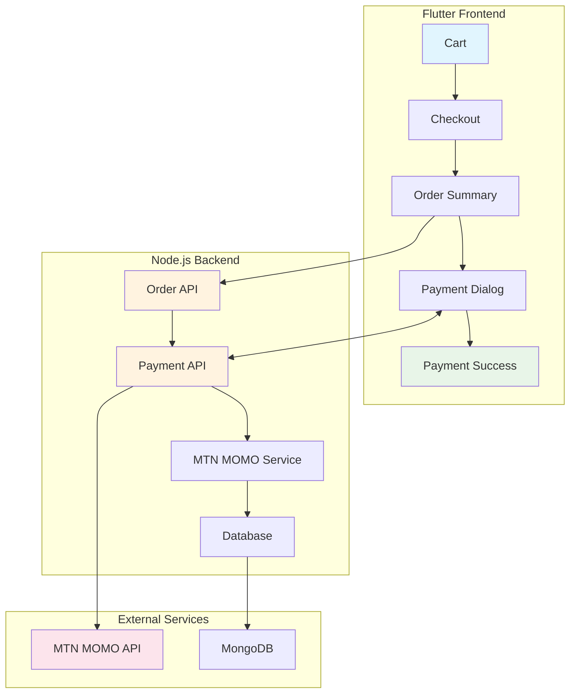
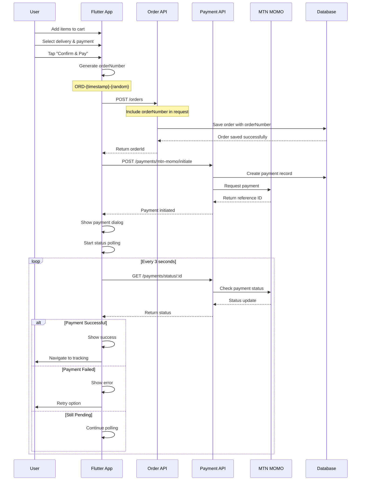
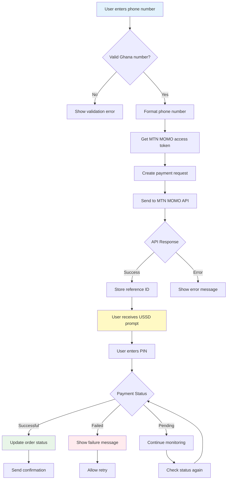
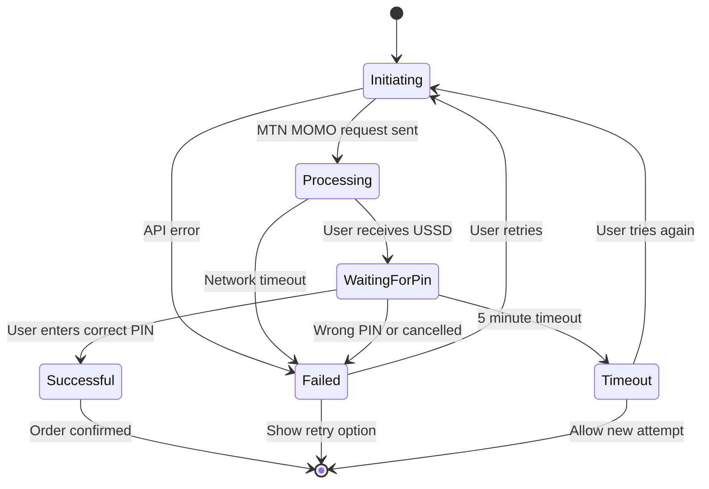
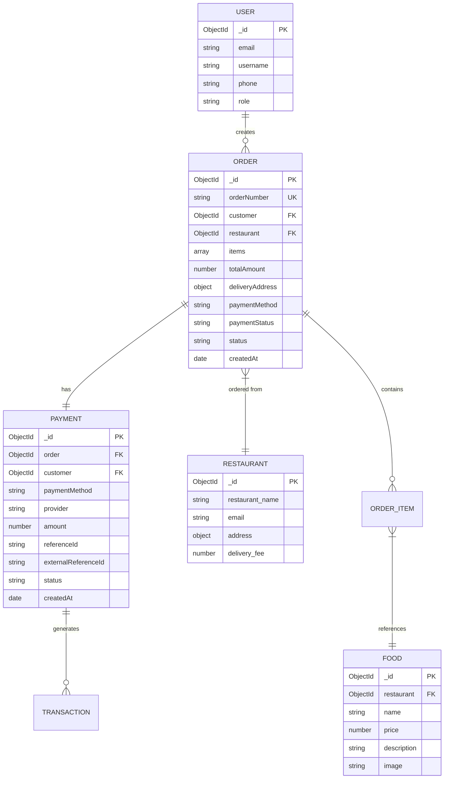
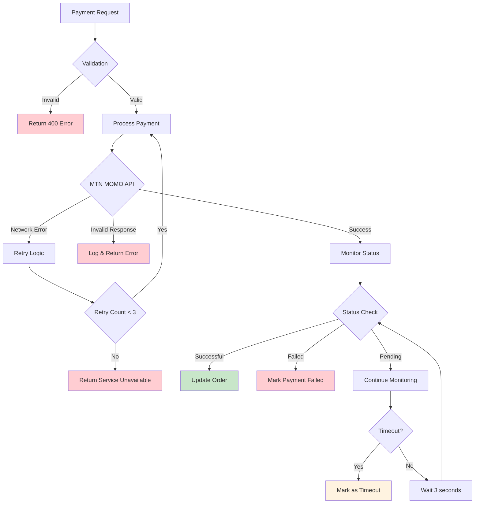
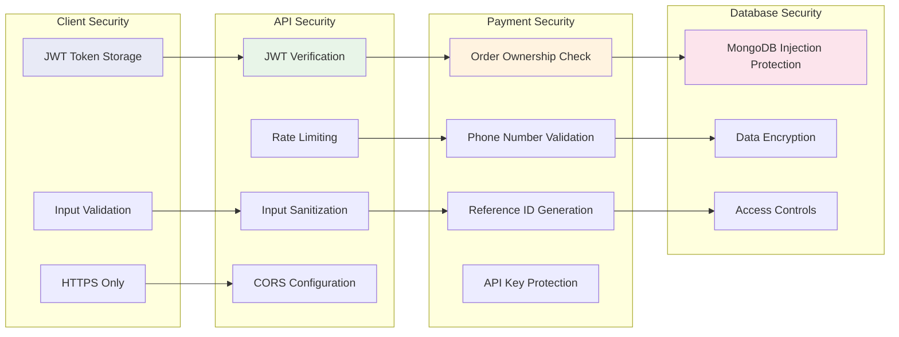
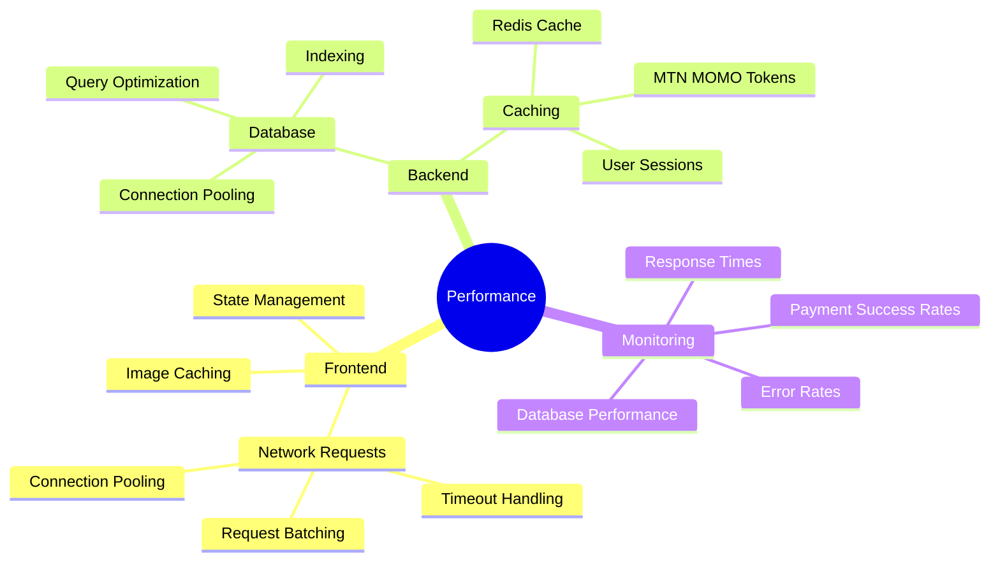
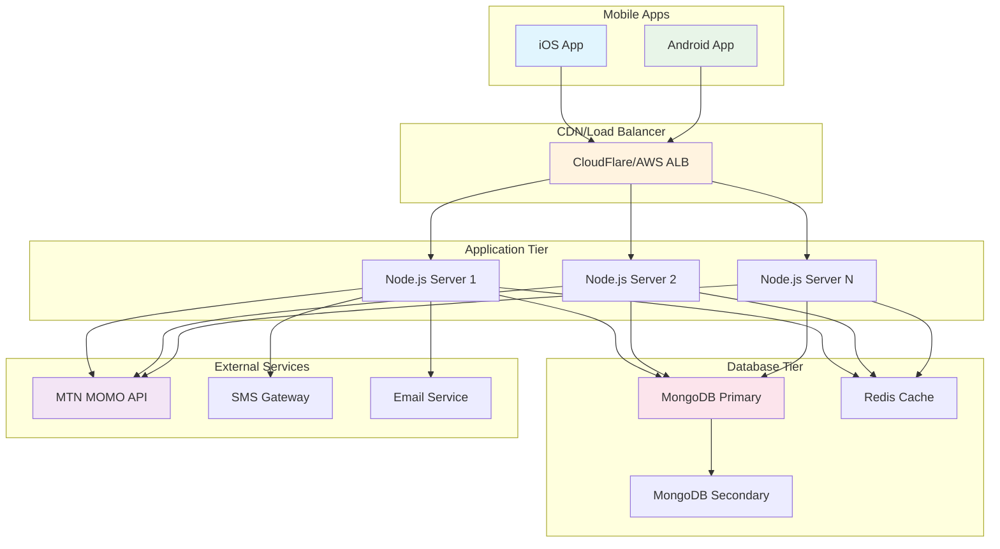
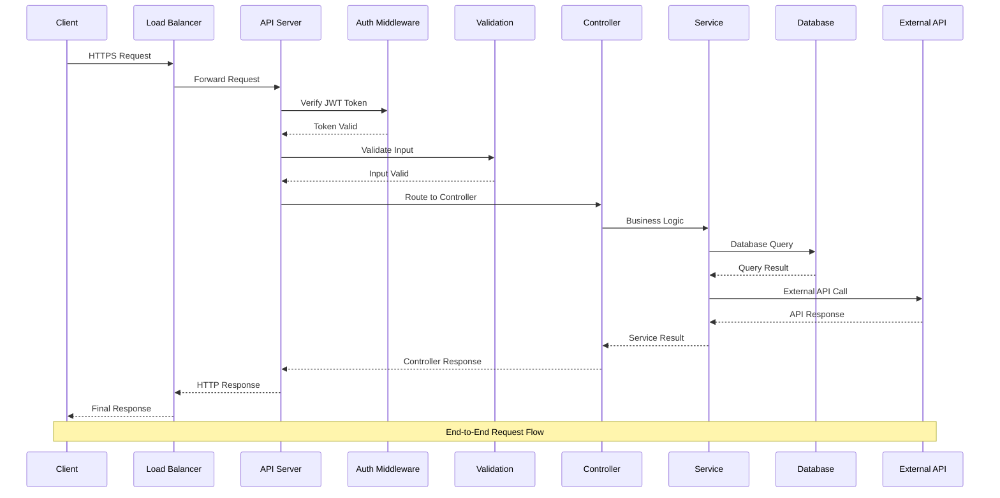

# GrabGo Payment System - Visual Diagrams

## System Architecture Overview

## Order Creation Flow

## MTN MOMO Integration Flow

## Payment Status State Machine

## Database Relationships

## Error Handling Flow

## Security Architecture

## Performance Optimization Points

## Deployment Architecture

## API Request/Response Flow

---

*These diagrams provide visual representations of the GrabGo payment system architecture, flows, and relationships. Use them for system understanding, debugging, and planning future enhancements.*